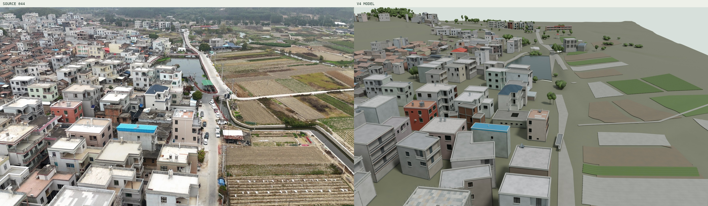

# XZ Village — V4 视频重建阶段存档

当前版本为 **2026-09-13 的 V4 重建审阅版**，包含 402 个建筑及附属单元，已统一去程与返程的相机和空间坐标。它仍未达到“所有建筑达到红框建筑质量”的最终目标；院落连接、部分立面和远景细节仍需继续完善。按当前安排，本次上传后暂停后续建模。

- [下载完整 V4 阶段版本](https://github.com/freezeng123456/XZ-Village/releases/tag/v4-rebuild-checkpoint-20260913)，包含 Blender 主模型、GLB、网页查看器、原片对照、逐栋图册、冻结数据和复建脚本。
- [V4 使用说明](outputs/rebuilt-v4/README.md)与[质量说明](outputs/rebuilt-v4/QUALITY.md)。网页查看器需下载后在本机打开，GitHub 文件预览不会执行三维页面。
- [后续接续记录](V4_CHECKPOINT.md)：已完成事项、文件位置、复建方式和未达标项。
- [复建脚本](outputs/rebuilt-v4/rebuild/)与[冻结模型数据](outputs/rebuilt-v4/data/)。

完整交付包的 SHA-256：`9b1dae1dfc04e71990cb8ac814e98763c88606157003c138de37abd9d83cf449`。包内含 512 个文件；压缩包读回校验和冻结数据复建检查通过。这些检查不替代建筑外观验收。

## 历史交付与原始基准

以下内容保留早期版本和制作过程。当前状态以以上 V4 说明为准。

The current deliverable completes 299 inventoried architectural units around the retained original landmark, for 300 numbered units including connected wings and small ancillary structures. Video-observed placement and source colours are combined with user-authorized estimates of hidden dimensions and details.

- [Final editable Blender scene](outputs/building-quality/Village_Reconstructed.blend)
- [Searchable source and dual-view building review](outputs/building-quality/Village_Review.html)
- [Chinese scope and verification report](outputs/building-quality/RECONSTRUCTION_REPORT.md)
- [Architectural pipeline and reproduction boundaries](REPRODUCE_ARCHITECTURE.md)

This is an architectural visualization, with approximate terrain and landscape context. Physical dimensions and unseen real-world details are not survey-verified. The earlier point-cloud continuation below is retained as historical evidence.

## Earlier September 12 aerial continuation

The new editable project is [`outputs/aerial-continuation/Village_Aerial_Continuation.blend`](outputs/aerial-continuation/Village_Aerial_Continuation.blend). It retains the original landmark and adds a multi-view reconstruction of the approach segment, 10 separately labelled neighbouring structural drafts, and traced pond/bridge elements.

- [Interactive point-cloud preview](outputs/aerial-continuation/Village_Viewer.html), self-contained and usable offline.
- [Chinese scope, evidence and validation report](outputs/aerial-continuation/RECONSTRUCTION_REPORT.md).
- [Reproduction commands](REPRODUCE_AERIAL.md).

The current dataset registers 57 approach frames into the main coordinate system. The 14 return frames form a separate reconstruction and are preserved as evidence, not silently merged. The working scale still inherits the old **estimated** 7.5 m landmark roof width. Approximate structural drafts and camera-dependent appearance are separate from observed surface patches. Holes, incomplete facades and rough geometry remain visible.

## Original landmark baseline

The main deliverable is [`outputs/Village_Realistic_Target.blend`](outputs/Village_Realistic_Target.blend). It focuses on the beige, three-storey landmark building at the village edge, with editable geometry for its facade panels, windows, terrace, railings, roof paving, rooftop equipment and front yard.

## Deliverables

| File | Purpose |
| --- | --- |
| [`outputs/Village_Realistic_Target.blend`](outputs/Village_Realistic_Target.blend) | Editable Blender 5.2 landmark-building project with embedded reference images |
| [`outputs/Target_Reference_Comparison.jpg`](outputs/Target_Reference_Comparison.jpg) | Source-frame and reconstructed-building comparison |
| [`outputs/Target_Realistic_Closeup.png`](outputs/Target_Realistic_Closeup.png) | Close-up render from the calibrated aerial viewpoint |
| [`outputs/Target_Geometry_Check.png`](outputs/Target_Geometry_Check.png) | Clay render for checking the modeled geometry |
| [`outputs/Village_Reference_View.png`](outputs/Village_Reference_View.png) | Village-scale reference viewpoint |
| [`outputs/重点建筑重建说明.txt`](outputs/重点建筑重建说明.txt) | Chinese notes on scope, precision and limitations |

The earlier broad village study is also included as `outputs/Village_Reconstruction.blend` with its overview renders.

## Model scope

The landmark building was manually matched to the 45–48 second part of the aerial video. Its nominal width, depth and height are visual estimates, because there is no survey or known physical scale in the footage. The neighboring village context is arranged from the video view and includes photo-projected elements; it is best viewed from the provided reference camera rather than treated as a complete survey-grade model.

To continue toward a full precise reconstruction, add at least one real-world dimension and clear front, rear and side photos for each building or a dense drone survey.

## Opening the project

Open the main `.blend` file in Blender 5.2 or a compatible later release. The project includes four cameras:

1. Calibrated landmark-building reference view
2. Village reference view
3. Road-side geometry inspection view
4. Roof inspection view

The original drone video is deliberately excluded from this repository because of its size and because it is source material rather than an output artifact.

## Scripts

The `work/` folder contains the reproducible Python scripts used for frame extraction, video-camera calibration, geometry construction, texture cleanup and rendering. Generated preview frames, virtual environments, logs and the source video are excluded.
